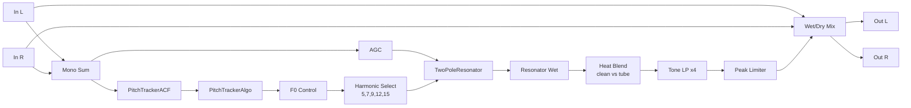

# PinchFX DSP Flow

## Control mapping

- `POSITION`: selects resonator harmonic multiple of tracked F0 (`5, 7, 9, 12, 15`)
- `RES`: sets resonator Q
- `HEAT`: increases tube drive and blends in more tube output
- `TONE`: sets cutoff of the cascaded 4-pole lowpass
- `MIX`: wet/dry crossfade (wet-biased equal-power taper)
- `MONITOR`: output tap selector for debugging

## Notes

- Gate is now analysis-only (confidence indicator), not part of wet audio gating.
- Legacy parameters (`SQUEAL`, `GLIDE`, `MODE`, `SENS`) are retained only for state compatibility.
