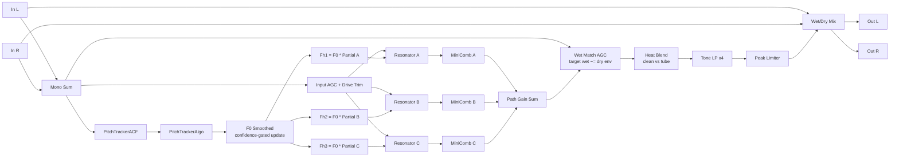

# PinchFX DSP Flow

## Control mapping

- `INPUT`: AGC drive trim into resonators (`-20 dB .. +20 dB` around unity).
- `TRACK DELAY`: tracker response time constant (slower/faster F0 smoothing).
- `A/B/C PARTIAL`: harmonic multiplier per voice (from `PinchFxPartials.h`: `2, 4, 5, 7, 8, 9, 12, 15`).
- `A/B/C RES`: normalized resonance control (`0..1`) sent to `TwoPoleControlledResonator`.
- `A/B/C FEEDBACK`: per-voice mini-comb feedback amount.
- `A/B/C GAIN`: per-voice gain before summing all wet voices.
- `HEAT`: tube blend amount (clean vs tube stage output).
- `TONE`: cutoff of cascaded 4-pole lowpass (`250 Hz .. 12 kHz`).
- `WET/DRY`: wet/dry equal-power crossfade (with wet-biased taper).

## Notes

- Pitch-confidence gate is analysis-only (scope/debug), not used to hard-gate wet audio.
- Resonator output level is matched to dry envelope by wet-match AGC before HEAT/TONE.
- Limiter is final wet-stage protection before host wet/dry mix.
- Hidden legacy parameter IDs are still kept for state compatibility (older presets/sessions).
